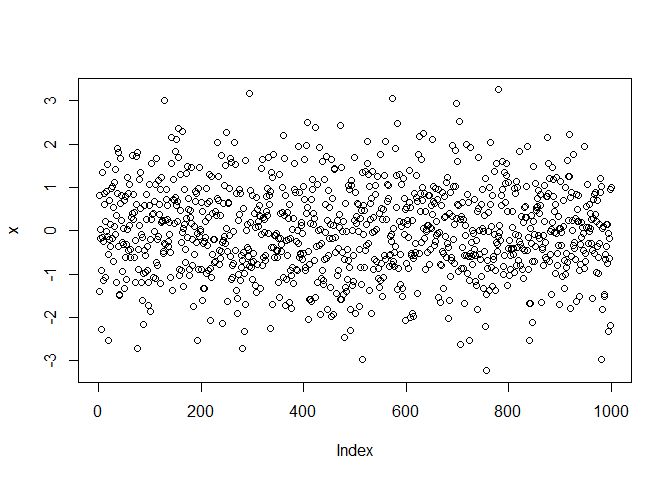
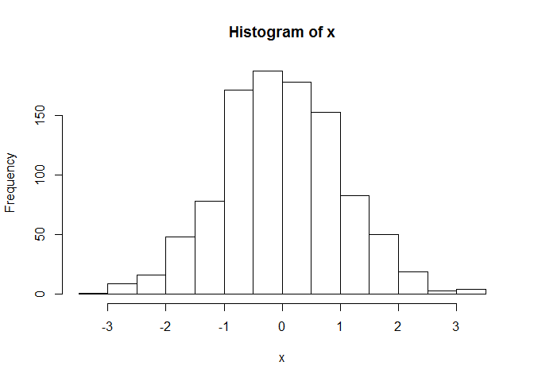

Why R?
------

-   Open Source

-   You can work with several datasets at the same time

-   You can create your own objects, functions and packages

-   Over 5,000 packages contributed by users available on CRAN

-   Rapid implementation of new (scientific) developments

-   Quick development of new tools that fit the user's demand

www.r-project.org
-----------------

R Basic
-------

Most R-users prefer the graphical user interface
([GUI](http://www.statmethods.net/interface/guis.html))

www.rstudio.com
---------------

First operations
----------------

[Creating new
variables](http://www.statmethods.net/management/variables.html)

    x<-rnorm(10,0,1)

creates a vector with ten standardnormal-distributed values

    mean(x)

    ## [1] -0.535552

calculates the mean of variable x

Getting help
------------

-   [Introduction to R](http://mirrors.softliste.de/cran/)
-   [stackoverflow](http://stackoverflow.com/questions/tagged/r)

Installing and Loading Packages
-------------------------------

    install.packages("sampling")
    require("sampling")

Basic Graphics
--------------

    x <- rnorm(1000,0,1)
    plot(x)

Histogram
---------

    hist(x)

The sample function
-------------------

[sample](https://stat.ethz.ch/R-manual/R-devel/library/base/html/sample.html)

